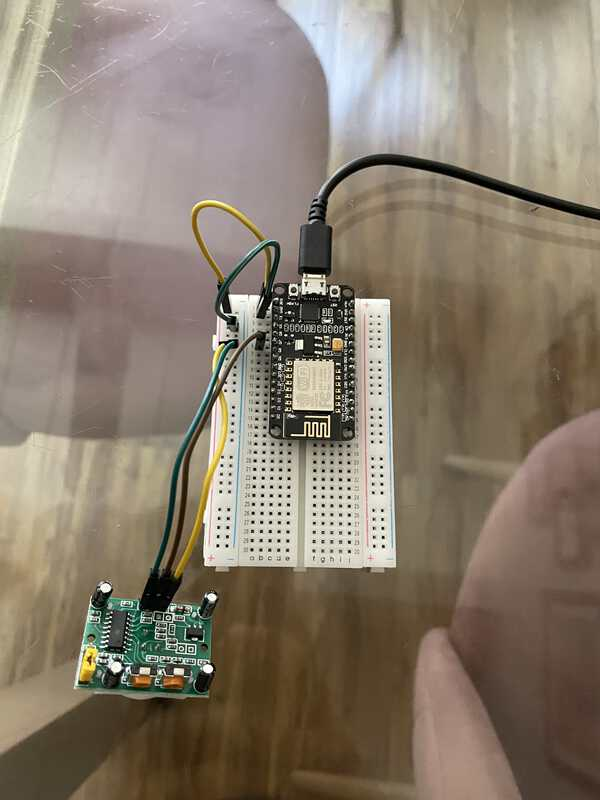
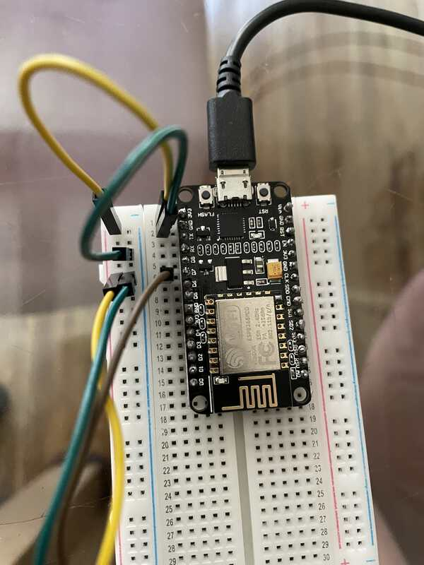

# ESP8266 NodeMCU
### Control Lifx lights when PIR sensor is triggered

## Hardware

- ESP8266 NodeMCU
- PIR Motion Sensor
- Breakout Breadboard
- Jumper Wires
- Micro USB Cable
- Soldering Gun (if the NodeMCU comes with the pins unsoldered)

## Setup

- Install Arduino IDE
- Install ESP8266 Board
    - Go to `File -> Preferences` and add http://arduino.esp8266.com/stable/package_esp8266com_index.json in `Additional Board Manager URLs`
    - Now search for `ESP8266` from `Tools -> Board -> Board Manager` and install it.
    - Choose the board from `Tools -> Board -> NodeMCU 1.0 (ESP 12-E Module)`
- Create a `Personal Access Token` in https://cloud.lifx.com
- Create `Sketch/secrets.h` and add the following
``` C++
#define SSID "<your-ssid>"
#define SSIDPASSWORD  "<your-ssid-password>"
#define LIFXTOKEN "<personal-access-token>"
```
- Run `python3 cert.py -s api.lifx.com -n lifx > Sketch/certs.h` to generate certs

## Circuit Connections




## Usage

Upload code to the board and control your lights if there is a motion detected!